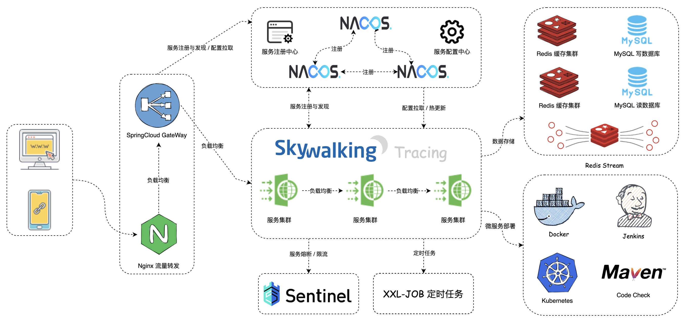
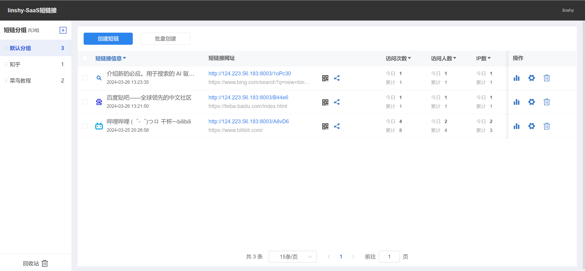
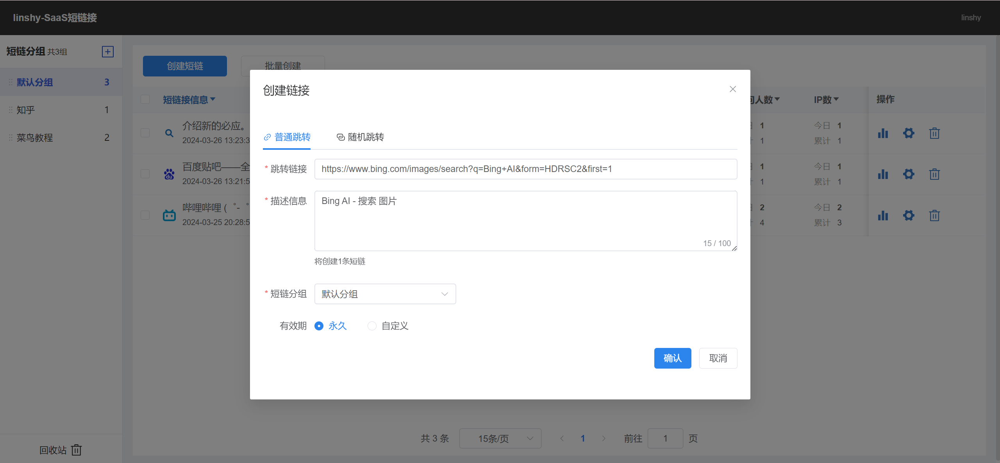
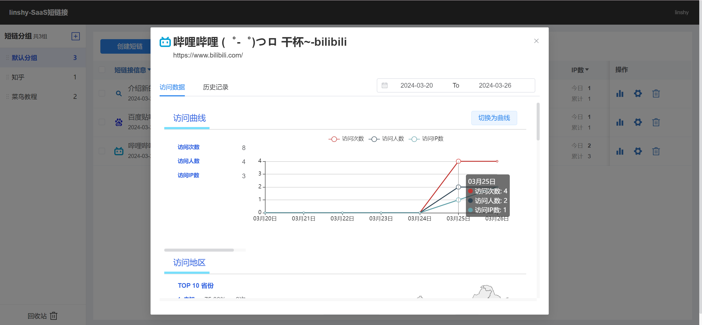
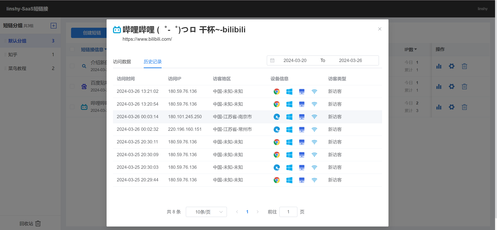

# linshy 短链接系统
## Java17 + SpringBoot + SpringCloudAlibaba + RocketMQ + ShardingSphere + Redis + MySQL + Sentinel

项目预览：http://124.223.56.183/

API 文档：https://apifox.com/apidoc/shared-63fe10fa-4f4e-427a-9be4-8900c2f3fac3

  

## 简介

短链接（Short Link）是指将一个原始的长 URL（Uniform Resource Locator）通过特定的算法或服务转化为一个更短、易于记忆的 URL。短链接通常只包含几个字符，而原始的长 URL 可能会非常长。

linshy 短链接系统，提供了一个高效且安全的平台来生成、管理和监控短链接。项目业务分为用户管理、短链接 管理、分组管理、短链接监控等模块，底层采用缓存、消息队列以及分库分表技术支持海量用户创建、维护短链接信息以及数据存储。

短链接的生成原理：

1. **生成唯一标识符**：当用户输入或提交一个长 URL 时，短链接服务会生成一个唯一的标识符或者短码。
2. **将标识符与长 URL 关联**：短链接服务将这个唯一标识符与用户提供的长 URL 关联起来，并将其保存在数据库或者其他持久化存储中。
3. **创建短链接**：将生成的唯一标识符加上短链接服务的域名（例如：http://s.linshy.cn）作为前缀，构成一个短链接。
4. **重定向**：当用户访问该短链接时，短链接服务接收到请求后会根据唯一标识符查找关联的长 URL，然后将用户重定向到这个长 URL。
5. **跟踪统计**：一些短链接服务还会提供访问统计和分析功能，记录访问量、来源、地理位置等信息。

作用：

- **提升用户体验**：用户更容易记忆和分享短链接，增强了用户的体验。
- **节省空间**：短链接相对于长 URL 更短，可以节省字符空间，特别是在一些限制字符数的场合，如微博、短信等。
- **美化**：短链接通常更美观、简洁，不会包含一大串字符。
- **统计和分析**：可以追踪短链接的访问情况，了解用户的行为和喜好。

## 功能模块 

### 用户管理

- 用户注册
- 用户登录
- 用户登出
- 用户信息查询
- 用户信息更改
- 检查用户名可用性

### 短链接分组管理

- 新增用户分组
- 查询用户分组
- 修改分组信息/排序
- 删除分组

### 短链接管理

- 短链接重定向
- 创建/批量创建短链接
- 查询短链接
- 修改短链接
- 查询分组下短链接数量/详情
- 查询单个/分组短链接指定时段内监控数据

### 回收站管理

- 短链接移至回收站
- 短链接移出回收站
- 回收站分页查询
- 短链接彻底删除

## 项目界面

  
  
  
  

